# CamRaff - Milestone Project 4 - Art of Darts

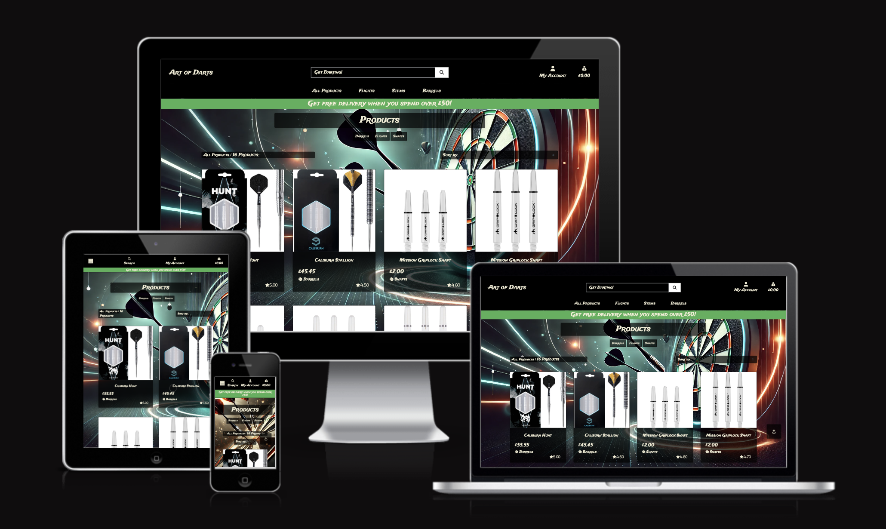

Here is a link to my deployed site: [Art of Darts](https://art-of-darts-mp4-13da8fbba8de.herokuapp.com/)

For my fourth and final project on my course with Code Institute via University Centre Peterborogh, I was tasked with creating a fully functional website that could be used as an e-commerce site, capable of allowing users to register and log in, save their details, search for and filter the items available, add to and view items in their bag, and finally complete their purchase. The site also requires superuser capability, allowing for store management and admin. 

I decided to create Art of Darts as a little bit of a passion project, as I have been a casual darts player myself for many years and having been witness to the massive blow up of darts following Luke Littler's success, I thought it would be fun to make something of my own relating to darts. 

---

# Contents

- [User Experience](#user-experience-ux)

    - [User Stories](#user-stories)

        - [Customer](#customer)

        - [Site Owner](#site-owneradmin)

- [Design](#design)

    - [Wireframes](#wireframes)

        - [Home](#home)

        - [All Products](#all-products)

        - [Product Details](#product-details)

        - [Bag](#bag)

        - [Checkout](#checkout)

        - [Checkout Success](#checkout-success)

        - [Profile](#profile)

        - [Product Add/Edit](#product-addedit)

    - [Typography](#typography)

    - [Colour Sceheme](#colour-scheme)

    - [Images](#images)

    - [Database Schema](#database-schema)

- [Development](#development)

- [Deployment](#deployment)

- [Local Development](#local-development)

- [Testing](#testing)

---

# User Experience (UX)

## User Stories

User Stories for this site will be split into several different sections. There is a lot more involved with this site, considering the site administration aspect, so there will be different User Story sections for each aspect of the site. 

### Customer

As a customer I would like to be able to:

#### Searching and Navigation

 - Navigate the site easily.
 - See a clear view of the products available, with sizes if applicable.
 - Sort/filter my view, to allow me to acquire what I am looking for quicker.

#### Registration and User Account

- Have the ability to register for an account if I wish.
- Receive confirmation that my registration was a success.
- Log in to a personalised user profile where I can save my details to make life easier for future purchases.
- Be able to request a password reset incase I forget my password down the line.

#### Bag View and Checkout

- Be able to view my bag clearly from the home page.
- Have the ability to adjust quantities in my bag if I change my mind as to how much I would like.
- Be able to checkout as a guest should I not wish to register for an account.
- Easily input my details for the purchase and feel like my details are safe and secure. 
- Receive confirmation that my purchase was successful.

### Site Owner/Admin

As the Owner and/or Admin of the site, I would like to:

- Add products to the store.
- Edit any available products from the store. 
- Delete products from the store when they are unavailable.

---

# Design

## Wireframes

### Home

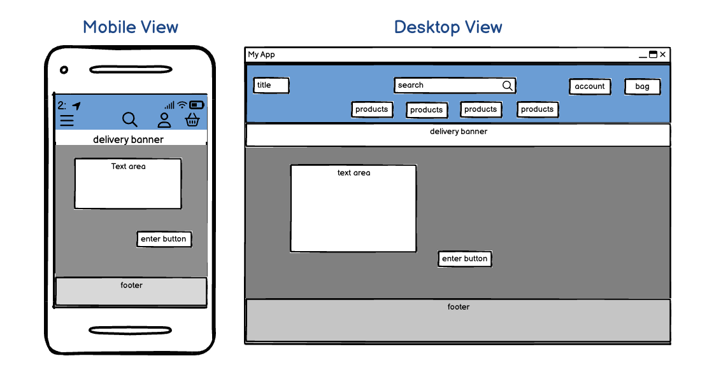

### All Products

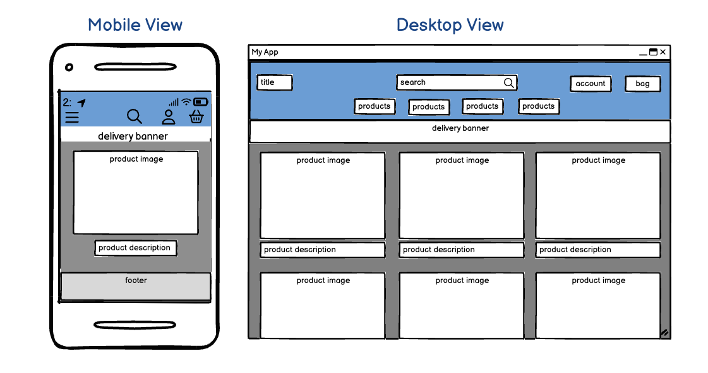

### Product Details

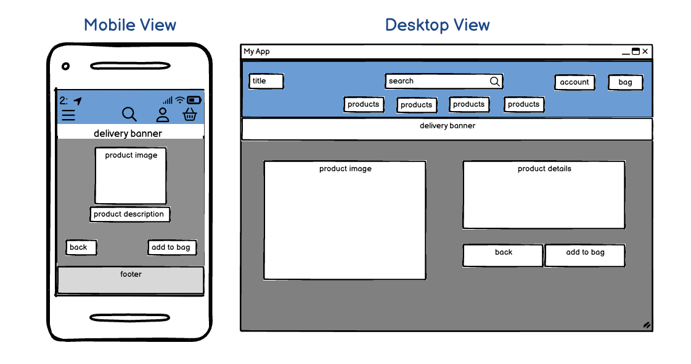

### Bag

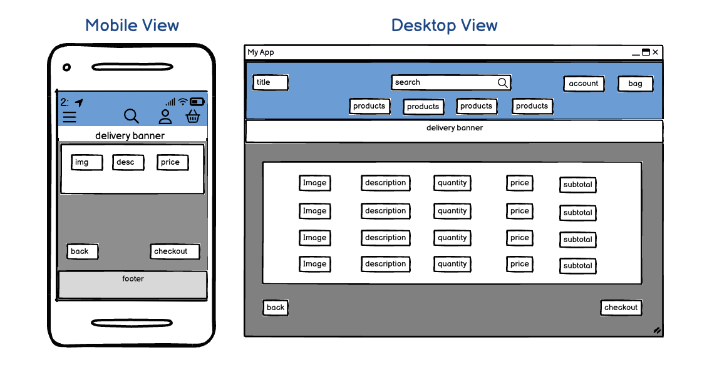

### Checkout

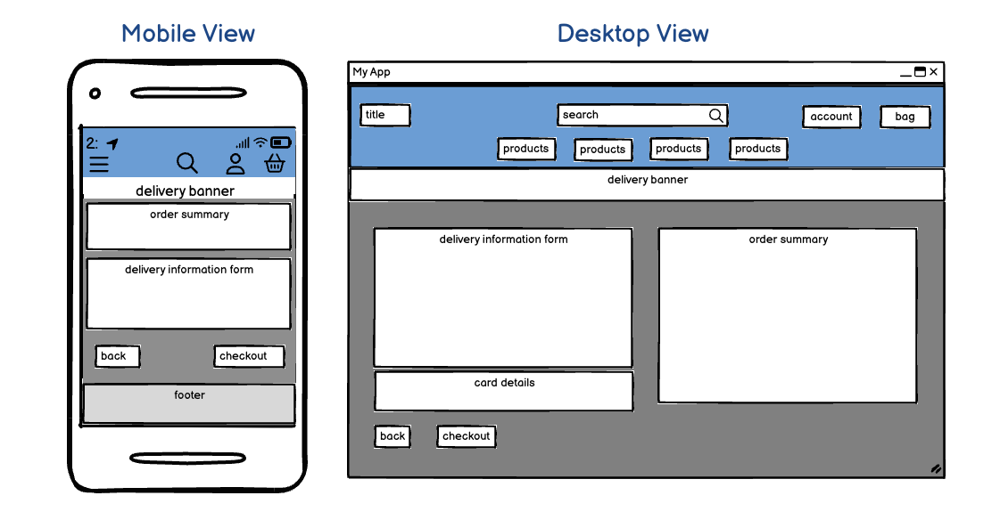

### Checkout Success

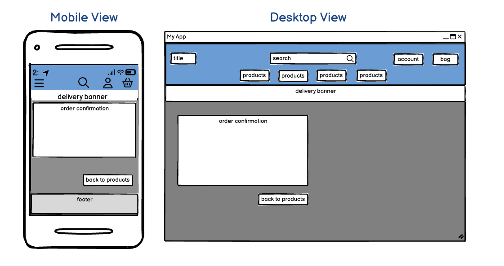

### Profile

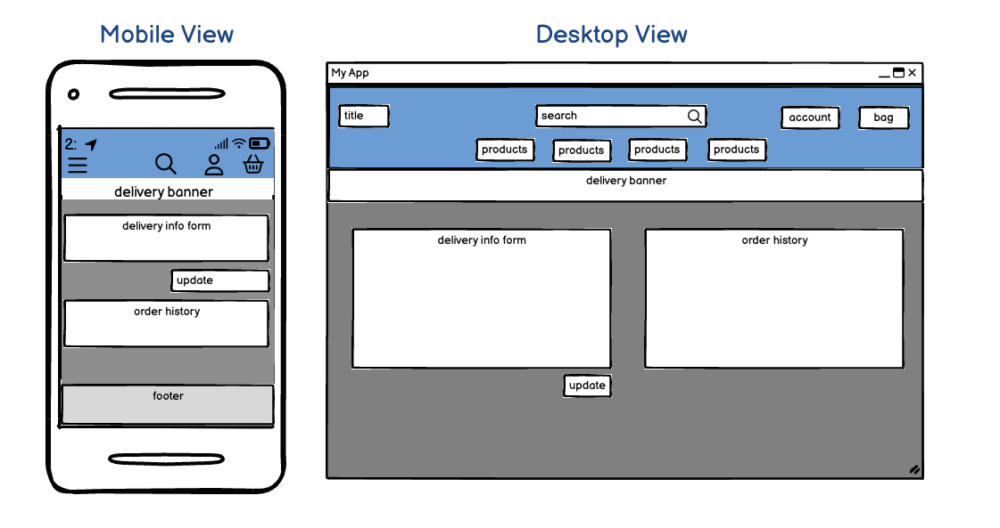

### Product Add/Edit

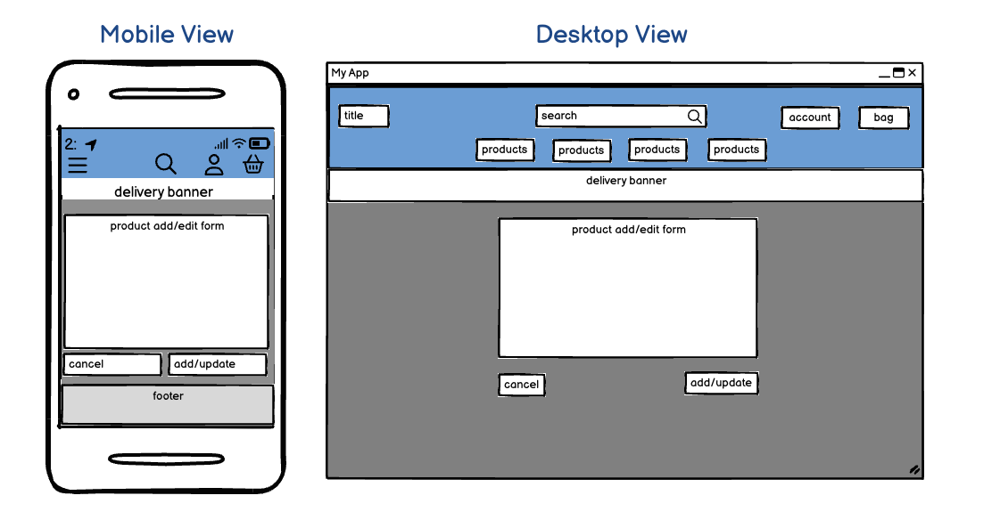

## Typography

For the font of the site, I wanted something that was seemingly sharp but also flowed well, like a dart flying through the air. I came across the font [Trade Winds](https://fonts.google.com/specimen/Trade+Winds?preview.text=Art%20of%20Darts&categoryFilters=Feeling:%2FExpressive%2FAwkward) when searching on [Google Fonts](https://fonts.google.com/) and thought that this font fitted the kind of vibe I was going for quite well.

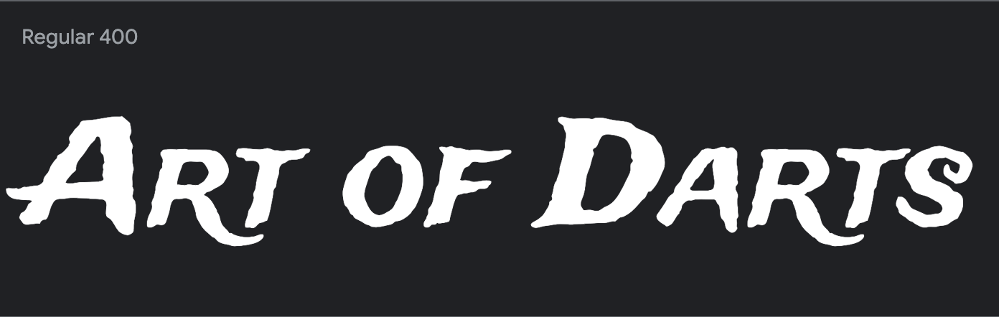

## Colour Scheme

As this website was designed with darts fans in mind, I decided that I wanted the colour scheme to match that of a dart board. I decided that the best way to do this was to have the background, like that of a dartboard, black. For the text colour, I wanted the most contrast so I chose a colour that I felt matched the "off-white" colour that opposes the black, and went with "#f2edd5". I also wanted a hover colour for links and buttons etc, and I didn't feel like red would have been the best choice considering the black background, and red usually signifies errors, so I went with a green colour I thought matched that of a dartboard's green quite well. For this, I chose "#4db057".

### #f2edd5 

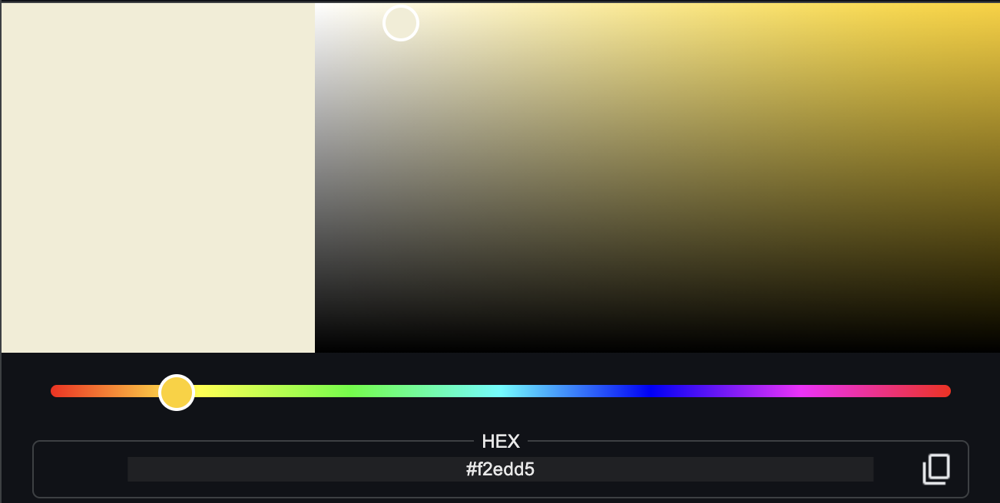

### #4db057

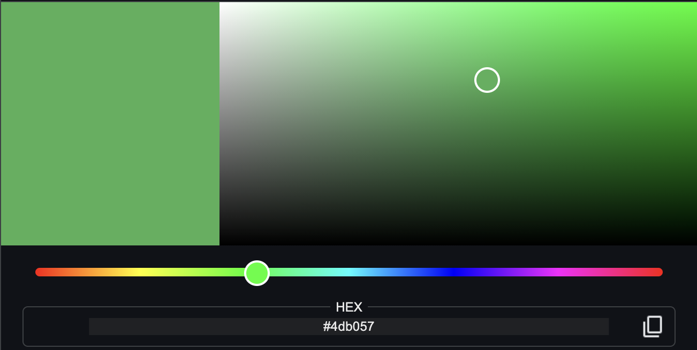

## Images

### Backgrounds

The background for this website was created by AI using [Chat GPT](https://chatgpt.com/).


I like this image as it provides a nice futuristic vibe, and its colours are very vibrant.

As the above background featured the dartboard over to the right hand side, I felt like the experience was lost stlightly on smaller devices, so I set a breakpoint of 700px, where I felt like the magic of the first image was lost, and set the below image as the background image for the site.


### Site Stock

For pictures of the stock on the website, I acquired the images from [Darts Corner](https://www.dartscorner.co.uk). 

### Favicon 

For the favicon for this site I opted to use the same image as that of the mobile background. This was acquired using [Favicon](https://favicon.io/).

## Database Schema

The below diagram was created using [DB Daddy](https://dbdaddy.dev/). 

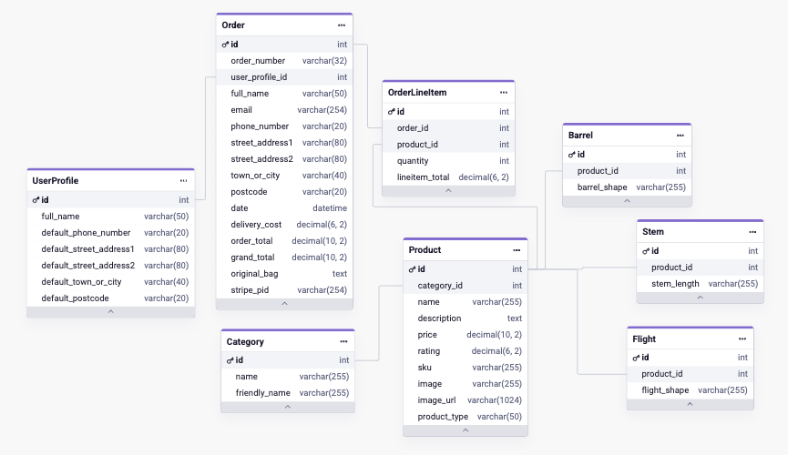

The database is a relational database, linking via foreign keys to their relevant models. The primary keys are denoted by the key symbol, and in each table the shaded section shows their connections.

### Admin Panel 

Below is a view of the administration panel following all models being produced and migrated.

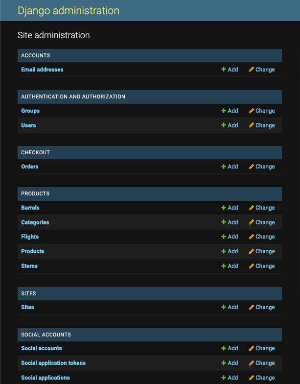

# Development

## Languages

This website was created using the following development languages:

- HTML (front-end basics)
- CSS (front-end customization)
- JavaScript (front-end functions)
- Python (back-end)

## Databases

[Postgres](https://www.postgresql.org/) was the platform I used to provide the relational database used to store the tables needed for the site.

## Frameworks

- [Django](https://www.djangoproject.com) was used as the back-end framework to build the site.
- [Bootstrap](https://getbootstrap.com/docs/4.6/getting-started/introduction/) was used as the front-end framework used to build the site and provide responsiveness.

## Libraries and Packages

- [jQuery](https://jquery.com/) is a JavaScript Framework that was used.
- [Font Awesome](https://fontawesome.com/) was used for the iconography of the site.
- [Django Allauth](https://django-allauth.readthedocs.io/en/latest/) was used for authentication, registration & account management.
- [django_crispy_forms](https://pypi.org/project/django-crispy-forms/) was used to provide a tag and filter to quickly render forms on the front-end.
- [gunicorn](https://pypi.org/project/gunicorn/) was used as a Python WSGI HTTP Server.
- [dj_databsae_url](https://pypi.org/project/dj-database-url/) was used to allow utilisation of the DATABASE_URL variable.
- [psycopg2](https://pypi.org/project/psycopg2/) was used as a postgres database adapter which allow us to connect with a postgres database.
- [django-storages](https://pypi.org/project/django-storages/) was used as a storage backend library.
- [boto3](https://pypi.org/project/boto3/) was used to allow connection to AWS S3 bucket.
- [coverage](documentation/testing/coverage/checkout-forms.png) was used for django testing.

## Programs

- [Git](https://git-scm.com/) was used for version control.
- [GitHub](https://github.com/) was used to save and store the files for this project.
- [Google Dev Tools](https://developer.chrome.com/docs/devtools/) was used to troubleshoot, test features and solve issues with responsiveness and styling.
- [Pip](https://pypi.org/project/pip/) was used as a tool for installing Python packages.
- [Stripe](https://stripe.com/gb) was used to allow for checkout functionality.
- [Heroku](https://www.heroku.com/) was used for deployment of the site upon completion.
- [AmIResponsive](https://ui.dev/amiresponsive) was used to create the main image at the top of the README and TESTING documents.

# Deployment

I deployed this project on Heroku and the steps to do so were as follows: 

1. Create a "requirements.txt" and a "Procfile".
    - to create the requirements.txt you can type "pip3 freeze --local > requirements.txt" into the terminal.
    - to create the Procfile you can type "echo web: gunicorn art_of_darts.wsgi:application > Procfile" into the terminal. You must ensure the P is capitalized and you haven't added any extensions to the end. You will know this has been done correctly if you can see the Heroku logo beside the file name. 
2. Login (or sign up if you havent already) to Heroku.
3. Click the "New" button at the top right of the dashboard and select "Create new app".
4. Add a unique name and select the correct region. Once done, click "Create app".
5. Connect your created Heroku app to your GitHub repository in the "Deploy" section. You can enable "Automatic Deploys" to ensure all pushed changes deploy straight to Heroku, if you wish.
6. Head to the "Settings" section and click to "Reveal Config Vars". Once there, input your desired environment variables. See below for an example:
    | KEY | VALUE |
    | :---- | :---- |
    | DATABASE_URL | POSTGRES_DB\* |
    | EMAIL_HOST_PASS | PASS\* |
    | EMAIL_HOST_USER | USER\* |
    | SECRET_KEY | SECRET_KEY\* |
    | USE_AWS | USE_AWS\* |

    \*Denotes a value that is specific to your app.
7. Connect repository, allowing automating deployment. 
8. Deploy your app

## Create and Connect the Postgres Database

1. Follow the steps provided to me from Code Institute to create the student specific database.
2. Set add the database to the settings "DATABASES = {'default': dj_database_url.parse('example-db-here')}".
3. Perform migrations.

## Set up AWS S3 Bucket

1. Sign up for AWS account.
2. Navigate to S3. 
3. Create a bucket. 
4. Enable ACLs.
5. Enable static website hosting.
6. Edit the the cross-origin resource sharing (CORS), inputting: 
```json
    [
        {
            "AllowedHeaders": [
                "Authorization"
            ],
            "AllowedMethods": [
                "GET"
            ],
            "AllowedOrigins": [
                "*"
            ],
            "ExposeHeaders": []
        }
    ]
```
6. Create a S3 Bucket policy for the bucket using a * to allow all principals and an action of 'GetObject'.
7. Input ARN from bucket policy editor tab and insert it into the policy ARN box.
8. Copy policy into bucket policy editor, adding /* onto end of resource key to allow access to all resources.
9. Go to access control list and set public access for everyone to list objects.


## Set up IAM

1. Navigate to IAM and create a group.
2. Click policies and then create policy.
3. Go to JSON tab then import the prebuilt AWS policy for access to S3. Search S3 and import "AmazonS3FullAccess".
4. Acquire ARN from S3, paste into the policy in "Resource" twice, adding a /* to the end of one of them.
5. Name and describe the policy and create.
6. Go to groups and attach the policy you've just created.
7. Create a user and allow programatic access, then add them to the group. 
8. Download and save CSV for AWS access and secret keys.

## Connect Django to S3

1. Add the following code in settings.py to use our bucket if we are using the deployed site:
```
    if 'USE_AWS' in os.environ:
        AWS_S3_OBJECT_PARAMETERS = {
            'Expires': 'Thu, 31 Dec 2099 20:00:00 GMT',
            'CacheControl': 'max-age=9460800',
        }
        
        AWS_STORAGE_BUCKET_NAME = 'enter your bucket name here'
        AWS_S3_REGION_NAME = 'enter the region you selected here'
        AWS_ACCESS_KEY_ID = os.environ.get('AWS_ACCESS_KEY_ID')
        AWS_SECRET_ACCESS_KEY = os.environ.get('AWS_SECRET_ACCESS_KEY')
        AWS_S3_CUSTOM_DOMAIN = f'{AWS_STORAGE_BUCKET_NAME}.s3.amazonaws.com'
```
2. Add these to your config vars in Heroku:
```
    | AWS_ACCESS_KEY_ID | ACCESS_KEY\* |
    | AWS_SECRET_ACCESS_KEY | SECRET_ACCESS_KEY\* |
    | USE_AWS | USE_AWS\* |

    \*Denotes a value that is specific to your app.
```
3. Create a file called custom_storages.py in the root and import settings and S3Botot3Storage. Create a custom class for static files and one for media files. These will tell the app the location to store static and media files.
4. Add the following to settings.py to let the app know where to store static and media files, and to override the static and media URLs in production.
```
    STATICFILES_STORAGE = 'custom_storages.StaticStorage'
    STATICFILES_LOCATION = 'static'
    DEFAULT_FILE_STORAGE = 'custom_storages.MediaStorage'
    MEDIAFILES_LOCATION = 'media'
    
    STATIC_URL = f'https://{AWS_S3_CUSTOM_DOMAIN}/{STATICFILES_LOCATION}/'
    MEDIA_URL = f'https://{AWS_S3_CUSTOM_DOMAIN}/{MEDIAFILES_LOCATION}/'
 ```
4. Navigate to the bucket and create the relevant folders and import your files.

## Set up Stripe

1. Create a Stripe account.
2. Log into Stripe, click developers and then API keys.
3. Go to Webhooks and input your Heroku URL as a destination to get your a WH Secret key.
4. Add these to your config vars in Heroku:
```
    | STRIPE_PUBLIC_KEY | PUBLIC_KEY\* |
    | STRIPE_SECRET_KEY | STRIPE_SECRET\* |
    | STRIPE_WH_SECRET | WH_SECRET\* |

    \*Denotes a value that is specific to your app.
```

# Local Development

## Fork

To fork this repository, follow these steps: 

1. Log in to GitHub (or sign up).
2. Go to the repository for this project - https://github.com/CamRaff/MP4-ArtOfDarts
3. Click the "Fork" button on the right, on the same line as the project name.
4. You will now be ready to work.

## Clone

To clone this repository, follow these steps: 

1. Log in to GitHub (or sign up).
2. Go to the repository for this project - https://github.com/CamRaff/MP4-ArtOfDarts
3. Click on the "Code" button above the number of commits. 
4. Select whether you would like to clone with HTTPS, SSH or GitHub CLI, then copy the given link.
5. Open the terminal in your desired IDE, then select your desired location for the cloned directory.
6. Type 'git clone' into the terminal, paste the link you copied in step 4 and press enter.
6. Set up a virtual environment (this step is not required if you are using the Code Institute Template in GitPod as this will already be set up for you).
7. Install the packages from the requirements.txt file by typing "pip3 install -r requirements.txt into the commant terminal.
8. You will now be ready to work. 

# Testing

Please see [TESTING.md](TESTING.md) for all testing performed.

# Credits 

## Code 

This project was created using methods taught in the Code Institutes walkthrough project for Boutique Ado.

## Content

Content for the site was written by Cameron Rafferty.

## Acknowledgements

I would like to acknowledge the following for assisting me throughout this project:

- My wonderful partner for their patience and support whilst working on my final project.

- [Mark Nevison](https://github.com/mnevison) once again. They've been there for me from the beginning.

- One of the Student Support tutors, Oisin Tohak, for their excellent assistance towards the end of this project.