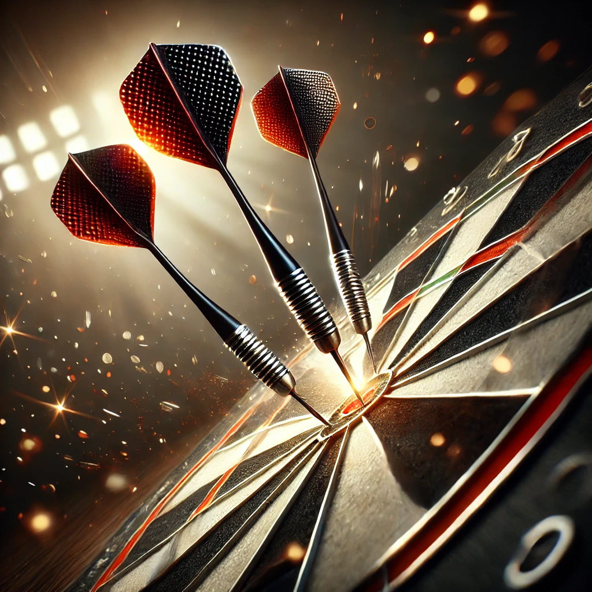

# CamRaff - Milestone Project 4 - Art of Darts

Here is a link to my deployed site: [Rogues Den](https://art-of-darts-mp4-13da8fbba8de.herokuapp.com/)

For my fourth and final project on my course with Code Institute via University Centre Peterborogh, I was tasked with creating a fully functional website that could be used as an e-commerce site, capable of allowing users to register and log in, save their details, search for and filter the items available, add to and view items in their bag, and finally complete their purchase. The site also requires superuser capability, allowing for store management and admin. 

I decided to create Art of Darts as a little bit of a passion project, as I have been a casual darts player myself for many years and having been witness to the massive blow up of darts following Luke Littler's success, I thought it would be fun to make something of my own relating to darts. 

---

# Contents

- [User Experience](#user-experience-ux)

    - [User Stories](#user-stories)

        - [Customer](#customer)

        - [Site Owner](#site-owneradmin)

- [Design](#design)

    - [Typography](#typography)

    - [Colour Sceheme](#colour-scheme)

    - [Images](#images)

---

# User Experience (UX)

## User Stories

User Stories for this site will be split into several different sections. There is a lot more involved with this site, considering the site administration aspect, so there will be different User Story sections for each aspect of the site. 

### Customer

As a customer I would like to be able to:

#### Searching and Navigation

 - Navigate the site easily.
 - See a clear view of the products available, with sizes if applicable.
 - Sort/filter my view, to allow me to acquire what I am looking for quicker.

#### Registration and User Account

- Have the ability to register for an account if I wish.
- Receive confirmation that my registration was a success.
- Log in to a personalised user profile where I can save my details to make life easier for future purchases.
- Be able to request a password reset incase I forget my password down the line.

#### Bag View and Checkout

- Be able to view my bag clearly from the home page.
- Have the ability to adjust quantities in my bag if I change my mind as to how much I would like.
- Be able to checkout as a guest should I not wish to register for an account.
- Easily input my details for the purchase and feel like my details are safe and secure. 
- Receive confirmation that my purchase was successful.

### Site Owner/Admin

As the Owner and/or Admin of the site, I would like to:

- Add products to the store.
- Edit any available products from the store. 
- Delete products from the store when they are unavailable.

---

# Design

## Typography

For the font of the site, I wanted something that was seemingly sharp but also flowed well, like a dart flying through the air. I came across the font [Trade Winds](https://fonts.google.com/specimen/Trade+Winds?preview.text=Art%20of%20Darts&categoryFilters=Feeling:%2FExpressive%2FAwkward) when searching on [Google Fonts](https://fonts.google.com/) and thought that this font fitted the kind of vibe I was going for quite well.

## Colour Scheme

As this website was designed with darts fans in mind, I decided that I wanted the colour scheme to match that of a dart board. I decided that the best way to do this was to have the background, like that of a dartboard, black. For the text colour, I wanted the most contrast so I chose a colour that I felt matched the "off-white" colour that opposes the black, and went with "#f2edd5". I also wanted a hover colour for links and buttons etc, and I didn't feel like red would have been the best choice considering the black background, and red usually signifies errors, so I went with a green colour I thought matched that of a dartboard's green quite well. For this, I chose "#4db057".

### #f2edd5 

### #4db057

## Images

### Backgrounds

The background for this website was created by AI using [Chat GPT](https://chatgpt.com/).

I like this image as it provides a nice futuristic vibe, and its colours are very vibrant.

As the above background featured the dartboard over to the right hand side, I felt like the experience was lost stlightly on smaller devices, so I set a breakpoint of 700px, where I felt like the magic of the first image was lost, and set the below image as the background image for the site.

### Site Stock

For pictures of the stock on the website, I acquired the images from [Darts Corner](https://www.dartscorner.co.uk). 