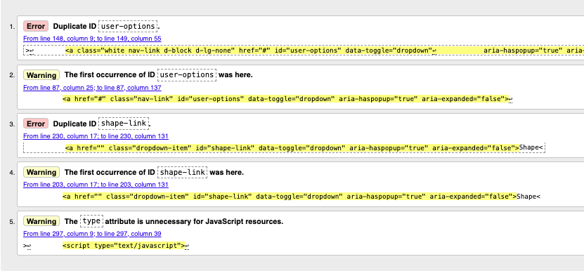
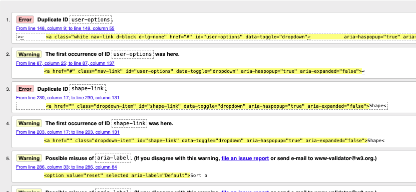
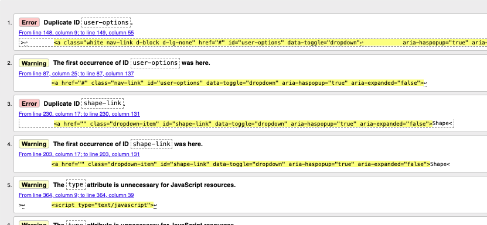
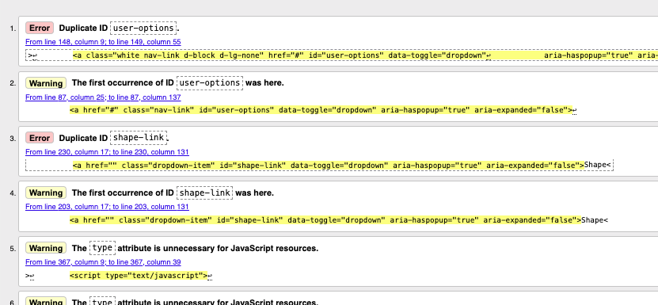
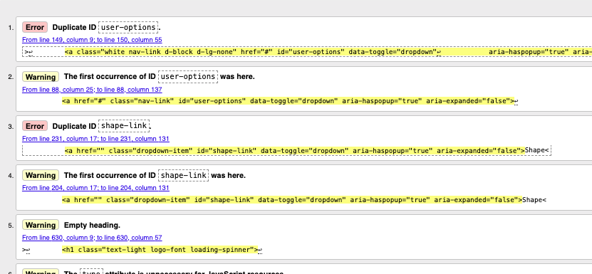
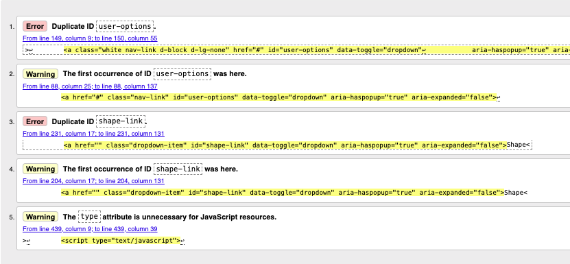

# CamRaff - Milestone Project 4 - Art of Darts

Here is a link to my deployed site: [Art of Darts](https://art-of-darts-mp4-13da8fbba8de.herokuapp.com/)

---

# Contents

- [Automated Testing](#automated-testing)

    - [W3C HTML Validator](#w3c-html-validator)

---

# Automated Testing

## W3C HTML Validator

To test all of the HTML pages on this site, I used the [W3C HTML Validator](https://validator.w3.org/). All pages flagged 2 errors regarding a duplicate ID. This is due to the main-nav.html and the mobile-nav-header.html being present on the page at the same time as they are "included", with only one being visible depending on the size of the screen. All pages that had javascript also had warnings regarding the 'type="text/javascript"' as apparently that isn't required.

### Home Page

### All Products Page

This page had several warnings about the potential mis-use of aria-labels, however, I believe these are necessary as they provide information about the options in the list.

### Product Details Page

### View Bag Page

### Checkout Page

### Checkout Success Page

