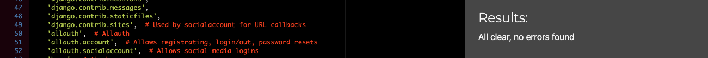
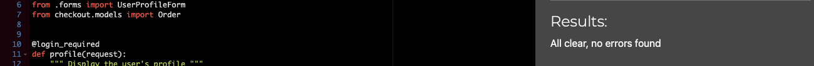
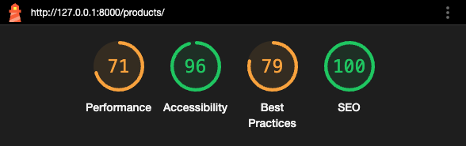

# CamRaff - Milestone Project 4 - Art of Darts

Here is a link to my deployed site: [Art of Darts](https://art-of-darts-mp4-13da8fbba8de.herokuapp.com/)

---

# Contents

- [Automated Testing](#automated-testing)

    - [W3C HTML Validator](#w3c-html-validator)

    - [CSS Jigsaw](#css-jigsaw)

    - [JS Hint](#js-hint)

    - [Python Validator](#python-validator)

        - [Profiles App](#profiles-app)

        - [Products App](#products-app)

        - [Home App](#home-app)

        - [Checkout App](#checkout-app)

        - [Bag App](#bag-app)

    - [Django Test Cases](#django-test-cases)

    - [Lighthouse](#lighthouse)

- [Manual Testing](#manual-testing)

    - [User Stories](#user-stories)

        - [Customer](#customer)

        - [Site Owner/Admin](#site-owneradmin)

    - [Site and Feature](#site-and-feature-testing)

        -[Features](#features)

    - [Bugs](#bugs)

---

# Automated Testing

## W3C HTML Validator

To test all of the HTML pages on this site, I used the [W3C HTML Validator](https://validator.w3.org/). All pages flagged an error due to the mobile-top-header.html and main-nav.html both being included in the page using Django syntax, with only 1 of them actually being visible depending on the size of the screen you're using. Each page that contained Javascript also had a warning due to me including 'type="text/javascript"' as apparently the type attribute isn't necessary for Javascript resources.

### Home Page

### All Products Page

This page had several warnings about the potential mis-use of aria-labels, however, I believe these are necessary as they provide information about the options in the list.

### Product Details Page

### View Bag Page

### Checkout Page

This page produced a warning due to the use of a h1 element to utilize the Font Awesome icon used as the loading spinner. As there was no text, it classed this element as being empty.

### Checkout Success Page

### Profile Page

### Add Product Page

This page had a duplicate attribute error due to me setting an ID to allow for Javascript to function, while the Django Widget also added an ID to the same element. I was unable to get the functionality the same while using the Django Widget ID, so I opted to allow this error.

### Edit Product Page

As this page utilized the same Django Widget, it produced the same error as above. 

## CSS Jigsaw

To test the CSS files used for this site, I used [CSS Jigsaw](https://jigsaw.w3.org/css-validator/). The results for each file were as follows:

### base.css

### profiles.css

### checkout.css

## JS Hint

To test the JavaScript file used in the site, I used [JSHint](https://jshint.com/). The test results were as follows:

## Python Validator

To test the Python that I implemented in the site, I used the [CI Python Linter](https://pep8ci.herokuapp.com/). The results for each module were as follows:

### Art of Darts

#### settings.py

#### urls.py

### Profiles App

#### views.py

#### urls.py

#### models.py

#### forms.py

#### test_views.py

#### test_models.py

#### test_forms.py

### Products App

#### widgets.py

#### views.py

#### urls.py

#### models.py

#### forms.py 

#### admin.py

#### test_views.py

#### test_models.py

#### test_forms.py

### Home App

#### views.py

#### urls.py

### Checkout App

#### webhooks.py

#### webhook_handler.py

#### views.py

#### urls.py

#### signals.py

#### models.py

#### forms.py

#### apps.py

#### admin.py

#### test_views.py

#### test_models.py

#### test_forms.py

### Bag App

#### views.py

#### urls.py

#### contexts.py

#### test_views.py

## Django Test Cases

After creating test files for the models, views and forms files in each app where necessary, I ran coverage to get a report for those apps. The results were as follows:

### Profiles App - 99%

### Products App - 84%

### Home App - 100%

### Checkout App - 73%

### Bag App - 93%

## Lighthouse

I used Lighthouse from [Google Dev Tools](https://developer.chrome.com/docs/) to test the performance, accessibility, best practices and SEO of the website on both desktop and mobile. All pages had a bit of an issue with best practices due to third party cookies from Stripe. This is unavoidable as it was necessary to have Stripe present on all pages for better security and fraud protection. Mobile pages seemed to struggle slightly with the layout shift, but this was a bootstrap issue. The results for all pages were as follows:

### Home - Desktop

### Home - Mobile

### All Products - Desktop

### All Products - Mobile

### Product Details - Desktop

### Product Details - Mobile

### Bag - Desktop

### Bag - Mobile

### Checkout - Desktop

### Checkout - Mobile

### Checkout Success - Desktop

### Checkout Success - Mobile

### Profile - Desktop

### Profile - Mobile

### Add Product - Desktop 

### Add Product - Mobile

### Edit Product - Desktop 

### Edit Product - Mobile

---

# Manual Testing

## User Stories

### Customer 

| Goals | Outcome |
| ----- | ----- |
| Navigate the site easily. | Site navigation is simple, with links available to access relevant pages at all times. |
| See a clear view of the products available with sizes if applicable.  | The products available are clearly displayed. |
| Sort/filter my view to allow me to acquire what I am looking for quicker. | Sorting and filtering is simple, clear and straight forward. |
| Have the ability to register for an account if I wish. | I can register for an account easily by accessing the 'My Account' drop down. |
| Receive confirmation that my registration was a success. | I received a confirmation upon registration. |
| Log in to a personalised user profile where I can save my details to make life easier for future purchases. | I am able to view my profile and save/update my details there. |
| Be able to request a password reset incase I forget my password down the line. | There is an option for password resetting incase I forget mine. |
| Be able to view my bag clearly from the home page. | My bag is visible when adding things from the home page. |
| Have the ability to adjust quantities in my bag if I change my mind as to how much I would like. | I can adjust the amount of items I want easily when viewing my bag. |
| Be able to checkout as a guest should I not wish to register for an account. | This is an option, though logging in is better. |
| Easily input my details for the purchase and feel like my details are safe and secure. | The checkout process was swift and secure. |
| Receive confirmation that my purchase was successful. | I received an email with my purchase details after I finished checking out. |

### Site Owner/Admin

| Goals | Outcome |
| ----- | ----- |
| Add products to the store. | The process is swift, functional and easily accessible in the 'My Account' dropdown. |
| Edit any available products from the store. | This process is swift and functional, and accessible from the products page or the product details page. |
| Delete products from the store when they are unavailable. | This process is swift and functional, and I receive a prompt making sure I am doing the correct thing. |

## Site and Feature Testing

All features of this site were tested extensively throughout development and post deployment to ensure full functionality throughout the process.

It was tested on the following devices:

- Mobile 

    - iPhone 15 Pro Max

- Laptop 

    - MacBook Air M2 - 15 Inch

- Monitor 

    - MSI Pro 27 Inch

Testing on browsers was conducted on the following: 

- Safari

- Chrome

- Firefox

### Features

| Feature | Expected outcome | Action | Result |
| ----- | ----- | ----- | ----- |
| **Navigation** |
| Search | Find related items | Used various search terms | Relevant items appeared |
| Products | Get directed to relevant products | Clicked | Relevant products displayed |
| Account | Register/Login displayed when unauthenticated | Clicked | Expected links appeared |
| Account | Profile/Logout displayed when authenticated | Clicked | Expected links appeared |
| Account | Product Management displayed when superuser | Clicked | Expected link appeared | 
| Bag | No products and link to products when empty | Clicked | No products displayed and a link back to All Products view |
| Bag | Products listed when added | Clicked | Relevant products displayed |
| Responsiveness | Hamburger for products when on small screen | Changed screen size | Hamburger menu appears |
| **Footer** | 
| Link to GitHub | Link to my Github | Clicked | Taken to my GitHub |
| **Home Page** |
| Link to products | Taken to All Products view | Clicked | Taken to All Products view |
| **All Products Page** | 
| Sort | Sort items from drop down | Tested all variations | Shown relevant items based on the parameter set |
| Back to top | Take back to top of page | Clicked | Page reloaded at the top |
| Access product details | Taken to Product Details view | Clicked image | Taken to Product Details view |
| Edit/Delete | Links visible when superuser | Logged in as superuser | Links visible |
| **Product Details** |
| Add | Add the item to bag | Clicked | Item added to bag | 
| Qty input | Error for <0 and >99 | Entered amount | Error appears upon trying to add to bag | 
| - Qty | Lower amount to 1 | Clicked | Quantity lowered to 1 and no lower |
| + Qty | Increase to 99 | Clicked | Quantity increased to 99 and no higher |
| Adding edited quantity | Add the changed quantity to the bag | Changed quantity and clicked add | Desired quantity added to bag |
| Back button | Taken back to All Products view | Clicked | Taken back to All Products view |
| **Bag** |
| Update button | Update quantity in bag | Changed value and clicked update | Quantity updated and total value displayed |
| - Qty | Lower amount to 1 | Clicked | Quantity lowered to 1 and no lower |
| + Qty | Increase to 99 | Clicked | Quantity increased to 99 and no higher |
| Remove button | Remove all of desired item from bag | Clicked | All of desired item removed |
| Back button | Taken back to All Products view | Clicked | Taken back to All Products view |
| Checkout button | Taken to Checkout view | Clicked | Taken to Checkout view |
| Checkout from toast | Taken to Checkout view from toast | Clicked when toast visible | Taken to Checkout view |
| **Checkout** |
| Form validation | Prompted to fill in required details | Attempted checkout with empty fields | Prompts appear |
| Save info checkbox if authenticated | Checkbox visible if authenticated | Went to checkout authenticated | Checkbox visible |
| Login/Register if not authenticated | Options visible if unauthenticated | Attempted checkout unauthenticated | Options visible |
| Payment validation | Prompted if incorrect values | Input bad values | Prompts appear |
| **Checkout Success** |
| Order confirmation | Order details visible on screen | Completed checkout | Order details visible |
| Link to products | Taken to All Products View | Clicked | Taken to All Products View |
| **Profile** |
| View order history | Link to view full details | Clicked | Taken to view full order details |
| Add delivery information | Add default delivery details | Input values | Details saved and visible |
| Edit delivery information | Update delivery details | Changed available values and clicked update | Values changed and visible |
| **Emails** | 
| Email confirm | Confirm registration email received | Registered | Email received | 
| Order confirmation | Order confirmation email received | Completed Checkout | Email received | 

## Bugs

No known bugs at this time.

